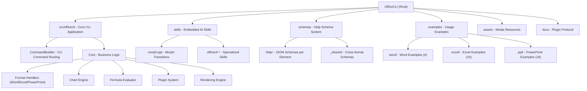

# OfficeCLI - AI Context Documentation

> **Last Updated:** 2026-05-18  
> **Version:** 1.0.93  
> **Repository:** https://github.com/iOfficeAI/OfficeCLI

---

## 📋 Change Log

| Date | Change | Impact |
|------|--------|--------|
| 2026-05-18 | Initial AI context documentation created | Root + module structure established |
| 2026-05-18 | Incremental update - Examples and Docs modules | 100% module documentation coverage achieved |

---

## 🎯 Project Vision

**OfficeCLI** is the world's first and best Office suite designed specifically for AI agents. It provides a command-line interface for creating, reading, and modifying Microsoft Office documents (.docx, .xlsx, .pptx) without requiring Microsoft Office installation.

### Core Philosophy

- **AI-Native Design**: Every command returns structured JSON, enabling seamless agent integration
- **Zero Dependencies**: Single self-contained binary with embedded .NET runtime
- **Universal Access**: Path-based element addressing (`/slide[1]/shape[2]`) abstracts away XML complexity
- **Progressive Complexity**: Three-layer architecture (Read → DOM → Raw XML) lets agents start simple and escalate only when needed
- **Built-in Rendering**: Agent-friendly HTML/PNG rendering engine closes the "render → look → fix" loop without Office

---

## 🏗️ Architecture Overview

### Technology Stack

- **Language**: C# (.NET 10.0)
- **Core Libraries**: DocumentFormat.OpenXml (3.4.1), OpenMcdf (3.1.3), System.CommandLine (3.0.0-preview)
- **Build System**: `dotnet publish` with self-contained single-file output
- **Platforms**: macOS (arm64, x64), Linux (x64, arm64, musl), Windows (x64, arm64)

### Project Structure



---

## 📦 Module Index

| Module | Path | Description | Status | Documentation |
|--------|------|-------------|--------|---------------|
| **Core CLI** | `src/officecli/` | Main application, command routing, business logic | ✅ Active | [CLAUDE.md](./src/officecli/CLAUDE.md) |
| **Skills** | `skills/` | Embedded AI skill files for specialized workflows | ✅ Active | [CLAUDE.md](./skills/CLAUDE.md) |
| **Schemas** | `schemas/` | JSON help system for element properties and validation | ✅ Active | [CLAUDE.md](./schemas/CLAUDE.md) |
| **Examples** | `examples/` | 37+ usage examples across all formats | ✅ Active | [CLAUDE.md](./examples/CLAUDE.md) |
| **Documentation** | `docs/` | Plugin protocol and technical specifications | ✅ Active | [CLAUDE.md](./docs/CLAUDE.md) |
| **Assets** | `assets/` | Showcase images, GIFs, and example documents | ✅ Static | N/A |

---

## 🚀 Getting Started

### Installation

```bash
# Quick install (macOS/Linux)
curl -fsSL https://raw.githubusercontent.com/iOfficeAI/OfficeCLI/main/install.sh | bash

# Windows (PowerShell)
irm https://raw.githubusercontent.com/iOfficeAI/OfficeCLI/main/install.ps1 | iex

# Verify
officecli --version
```

### Build from Source

```bash
# Build for current platform
./build.sh release

# Build for all platforms
./build.sh all

# Output: bin/release/officecli-<platform>
```

### Quick Test

```bash
# Create a presentation
officecli create deck.pptx

# Add content
officecli add deck.pptx / --type slide --prop title="Hello World"

# View result
officecli view deck.pptx outline
```

---

## 🧪 Testing Strategy

### Test Organization

- **Unit Tests**: Embedded in command handlers (see `Core/` classes)
- **Integration Tests**: Example scripts in `examples/` directory (37+ scripts)
- **Schema Validation**: JSON schemas in `schemas/help/` validated on build
- **Manual Testing**: Use `officecli validate <file>` to check document integrity

### Running Tests

```bash
# Validate a document
officecli create test.docx
officecli add test.docx /body --type paragraph --prop text="Test"
officecli validate test.docx

# Check for issues
officecli view test.docx issues
```

---

## 📐 Coding Standards

### C# Conventions

- **Namespace**: `OfficeCli` (root namespace)
- **File Organization**: One class per file, matching directory structure
- **Naming**: PascalCase for public members, _camelCase for private fields
- **Async/Await**: Use async I/O for file operations where applicable
- **Error Handling**: Custom `CliException` with structured error codes

### Command Pattern

- All CLI commands inherit from `CommandBuilder`
- Use `--prop key=value` for element properties
- Support `--json` flag for structured output
- Provide built-in help via `officecli <format> <command> <element>`

### JSON Schema Standards

- All element properties documented in `schemas/help/<format>/<element>.json`
- Include aliases, examples, and validation rules
- Use snake_case for JSON keys
- Provide human-readable descriptions for AI agents

---

## 🤖 AI Integration Guide

### Three-Layer Architecture

| Layer | Purpose | Commands | Example |
|-------|---------|----------|---------|
| **L1: Read** | Semantic content views | `view` (text, annotated, outline, stats, issues) | `officecli view deck.pptx outline` |
| **L2: DOM** | Structured element operations | `get`, `query`, `set`, `add`, `remove`, `move`, `swap` | `officecli set deck.pptx '/slide[1]/shape[1]' --prop text="Hi"` |
| **L3: Raw XML** | Direct XPath access | `raw`, `raw-set`, `add-part`, `validate` | `officecli raw deck.pptx '/slide[1]'` |

### Path-Based Addressing

```bash
# PowerPoint: /slide[N]/shape[M]
officecli get deck.pptx '/slide[1]/shape[2]'

# Word: /body/p[N]/r[M] (paragraph N, run M)
officecli set doc.docx '/body/p[1]/r[1]' --prop bold=true

# Excel: /SheetN/cell[address] or /SheetN/cell[row,col]
officecli get data.xlsx '/Sheet1/cell[A1]'
```

### Error Handling

All commands support `--json` with structured error responses:

```json
{
  "success": false,
  "error": {
    "error": "Slide 50 not found (total: 8)",
    "code": "not_found",
    "suggestion": "Valid Slide index range: 1-8"
  }
}
```

### Built-in Help System

```bash
officecli help                          # All commands + entry points
officecli help docx                     # All docx elements
officecli help docx paragraph           # Full schema for paragraph
officecli help docx set paragraph       # Only settable properties
officecli help docx paragraph --json    # Machine-readable schema
```

---

## 🔌 Plugin System

OfficeCLI supports external plugins for:

- **Legacy formats** (.doc, .rtf, .odt) via dump-reader plugins
- **Export targets** (.pdf, .epub) via exporter plugins  
- **Regional formats** (.hwpx, .hwp) via format-handler plugins

See [docs/plugin-protocol.md](docs/plugin-protocol.md) for complete specification.

### Plugin Discovery

1. Environment variable: `$OFFICECLI_PLUGIN_<KIND>_<EXT>`
2. User plugins: `~/.officecli/plugins/<kind>/<ext>/plugin`
3. Bundled plugins: `<binary-dir>/plugins/<kind>/<ext>/plugin`
4. PATH lookup: `officecli-<kind>-<ext>` or `officecli-<ext>`

---

## 📊 Key Features by Format

### Word (.docx)

- Full i18n & RTL support (per-script fonts, BCP-47 lang tags)
- Paragraphs, runs, tables, styles, headers/footers
- Images (PNG/JPG/GIF/SVG), equations, comments, footnotes
- Watermarks, bookmarks, TOC, charts, hyperlinks
- Form fields, content controls (SDT), fields (22 types), OLE objects

### Excel (.xlsx)

- Cells with phonetic guides (furigana)
- 150+ built-in functions with auto-evaluation
- Sheets (visible/hidden/veryHidden, RTL support)
- Tables, sort, conditional formatting
- Charts (including box-whisker, pareto, log axis)
- Pivot tables (multi-field, date grouping, calculated fields)
- Named ranges, data validation, images, sparklines

### PowerPoint (.pptx)

- Slides (header/footer, hidden slides)
- Shapes (pattern fill, blur effects, hyperlinks)
- Images (PNG/JPG/GIF/SVG, fill modes)
- Tables, charts, animations, morph transitions
- 3D models (.glb), slide zoom, equations
- Themes, connectors, video/audio, groups
- Notes, comments, OLE objects, placeholders

---

## 🔑 Common Workflows

### Batch Document Generation

```bash
# Template merge
officecli merge template.docx output-001.docx '{"name":"Acme","total":"$5,200"}'
officecli merge template.docx output-002.docx '{"name":"Beta","total":"$3,400"}'
```

### Round-Trip Dump

```bash
# Learn from existing document
officecli dump existing.docx -o blueprint.json
# Mutate and replay
officecli batch new.docx --input blueprint.json
```

### Resident Mode (Performance)

```bash
# Keep document in memory for 3+ operations
officecli open report.docx
officecli add report.docx /body --type paragraph --prop text="Fast"
officecli set report.docx '/body/p[1]' --prop bold=true
officecli close report.docx
```

---

## 🛠️ Development Workflow

### Adding a New Command

1. Create `CommandBuilder.<CommandName>.cs`
2. Implement command logic in `Core/`
3. Add JSON schema to `schemas/help/`
4. Update examples and documentation
5. Test with `officecli validate`

### Modifying Core Logic

1. Locate handler in `Core/` (e.g., `ChartHelper.cs`)
2. Update business logic
3. Add/modify JSON schemas if API changes
4. Run example scripts to verify
5. Update SKILL.md if agent-facing behavior changes

### Debugging

```bash
# Enable verbose logging
officecli --verbose command ...

# Validate document structure
officecli validate file.docx

# Check for issues
officecli view file.docx issues --json

# Inspect raw XML
officecli raw file.docx /body
```

---

## 📚 External Resources

- **GitHub Repository**: https://github.com/iOfficeAI/OfficeCLI
- **Wiki**: https://github.com/iOfficeAI/OfficeCLI/wiki
- **Issues**: https://github.com/iOfficeAI/OfficeCLI/issues
- **Website**: https://officecli.ai
- **Discord**: https://discord.gg/2QAwJn7Egx

---

## 📄 License

Apache License 2.0 - See [LICENSE](LICENSE) for details.

---

## 📈 Documentation Coverage

**Module Coverage**: 100% (5/5 modules documented)

- ✅ Core CLI Application - Comprehensive architecture and subsystems
- ✅ Skills Module - All AI skills documented
- ✅ Schema System - Help system structure documented
- ✅ Examples Module - 37+ examples catalogued
- ✅ Documentation Module - Plugin protocol fully specified

**Next Steps**:
- Add inline code comments to Core subsystems
- Create developer onboarding guide
- Add performance benchmarks documentation
- Create troubleshooting guide

---

*This documentation is maintained for AI agents and developers working with OfficeCLI. For the most up-to-date information, always refer to the official GitHub repository and Wiki.*
